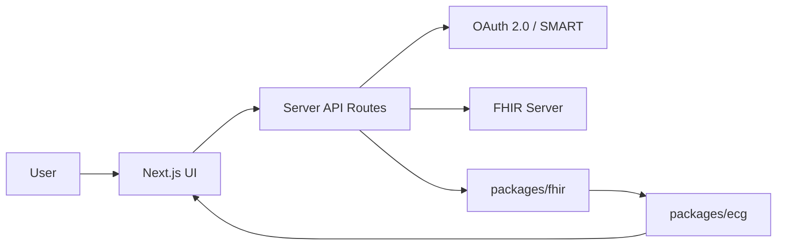

# ECGViewer Architecture

## Layers

## Data Boundary

FHIR resources enter the system as untrusted JSON. API routes pass that JSON to `packages/fhir`, which returns a normalized `EcgRecord` or structured parser errors. UI components render only normalized records.

## Normalized ECG Model

- `patientId`: requested or parsed Patient id.
- `observationId`: FHIR Observation id.
- `effectiveDateTime`: acquisition time when available.
- `samplingFrequencyHz`: samples per second.
- `leads`: one series per ECG lead.
- `units`: measurement unit, usually mV or uV.

## Performance Strategy

- Store sample arrays as `Float32Array` after parsing.
- Render only the visible time window.
- Use min/max downsampling per pixel column to preserve spikes.
- Keep worker-compatible pure functions so heavy parsing and downsampling can move off the main thread.

## Clinical Boundary

ECGViewer can compute simple measurements such as duration, min/max amplitude, mean amplitude, and estimated heart-rate helpers in future work. It must not make diagnostic claims without validated clinical algorithms and regulatory review.
